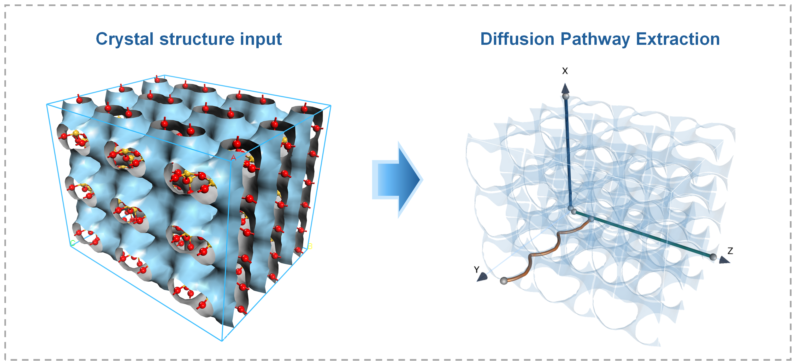

# DeepDiffusion-X – High-Throughput Zeolite Diffusivity Prediction, Anisotropy Identification, and Mechanistic Interpretation

DeepDiffusion-X is a desktop platform for rapid and efficient prediction of direction-resolved self-diffusion coefficients, identification of diffusion anisotropy, and mechanistic interpretation of structure–diffusion relationships in zeolites directly from CIF crystal structures.

<p align="center">
  
</p>

## Features

The software provides four main functions:

1. **Descriptor Extraction**
   Construct the potential energy grid, assign the channel dimensionality (1D/2D/3D), and evaluate the minimax diffusion barrier along each traversable direction by a min-bottleneck Dijkstra search. 

2. **Directional Diffusivity Prediction**
   Predict the self-diffusion coefficient separately for the X, Y and Z directions of each framework. Results are displayed in the interface and written to an Excel workbook.

3. **Interpretability**
   Compute SHAP contributions against a training-set background distribution to quantify descriptor contributions to individual predictions. Waterfall plots are generated for each sample.

4. **Pathway Visualization**
   Export interactive 3D HTML figures of the pore envelope and the minimum energy pathway along each traversable direction.

## Requirements

```
python         3.10+
numpy          1.24+
scipy          1.10+
pandas         2.0+
torch          2.0+
shap           0.44+
matplotlib     3.7+
ase            3.22+
pymatgen       2023.0+
scikit-learn   1.3+
PySide6        6.5+
plotly         5.15+
openpyxl       3.1+
joblib         1.3+
numba          0.58+     
scikit-image   0.21+     
```

### Running the Software

```bash
python run_gui.py
```

## Usage

1. Select the folder containing the CIF files
2. Select a working directory for the output
3. Adjust the calculation parameters if required (defaults are listed below)
4. Click "Run" and follow the progress in the "Run log" tab
5. Inspect the results in the "Descriptors", "Diffusivity"


## File Structure

```
├── run_gui.py                       # Application entry point
├── core/
│   ├── pipeline.py                  # End-to-end workflow orchestration
│   ├── symmetry.py                  # CIF symmetry removal (P1 expansion)
│   ├── pore_size.py                 # GCD and directional PLD
│   ├── grid_generation.py           # Lennard-Jones potential energy grid
│   ├── pore_channel_analyzer.py     # Dimensionality and diffusion barriers
│   ├── descriptors.py               # Pathway descriptor extraction
│   ├── feature_merge.py             # Assembly of the 13-dimensional feature table
│   ├── descriptor_names.py          # Descriptor nomenclature and symbols
│   ├── model.py                     # ANN architecture and checkpoint loading
│   ├── predict.py                   # Feature scaling and inference
│   ├── shap_explain.py              # SHAP value computation
│   ├── shap_original.py             # ln(Ds) to Ds conversion and waterfall plots
│   └── llm_chat.py                  # Mechanistic interpretation assistant
├── gui/
│   ├── app.py                       # Main window and result panels
│   ├── glossary.py                  # Nomenclature dialog
│   └── style.py                     # Interface style sheet
├── ml/
│   ├── ann_final_model.pth          # Trained ANN model
│   └── scaler.pkl                   # Fitted feature scaler
└── assets/
    ├── external_descriptors.xlsx    # Framework descriptors (FDSi, Vacc, ASA)
    └── shap_background.xlsx         # Training-set background for SHAP
```

## Output

Results are written to the working directory:

```
├── DeepDiffusionX_results.xlsx      # Descriptors, Diffusivity, SHAP_Values, Nomenclature
├── 02_barrier_analysis/             # *_diffusion_path_X/Y/Z.html
└── 03_shap/                         # Waterfall plots
```

The descriptors used for diffusion prediction:

| Feature | Source | Description |
|---------|--------|-------------|
| *E*barrier | Computed | Diffusion barrier (kJ mol⁻¹) |
| *E*max | Computed | Maximum pathway energy (kJ mol⁻¹) |
| *E*min | Computed | Minimum channel energy (kJ mol⁻¹) |
| σ*E* | Computed | Pathway energy standard deviation (kJ mol⁻¹) |
| *G*E,mean | Computed | Mean local barrier energy gradient (kJ mol⁻¹ Å⁻¹) |
| ρbarrier | Computed | Local barrier linear density (Å⁻¹) |
| *H*E | Computed | Pathway energy differential entropy |
| *P*τ | Computed | Pathway tortuosity |
| ηmain | Computed | Main-axis transport efficiency |
| PLD | Computed | Pore limiting diameter (Å) |
| FDSi | IZA/POCD | Framework density (T/1000Å⁻³) |
| Vacc | Zeo++ | Accessible pore volume fraction (%) |
| ASA | Zeo++ | Accessible surface area (m² g⁻¹) |
| **Predicted_Ds (×10⁻⁸ m² s⁻¹)** | **ANN** | **Directional self-diffusion coefficient** |

## Citation

"Unraveling the Structural Origins of Anisotropic Diffusion in Zeolites via Interpretable Machine Learning"

## Contact

For questions or issues, contact: WXB047721@126.com
